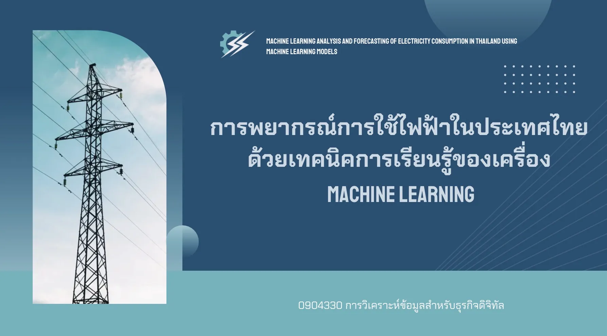

<html lang="th" class="scroll-smooth">
<head>
    <meta charset="UTF-8">
    <meta name="viewport" content="width=device-width, initial-scale=1.0">
    <!-- ชื่อแท็บของหน้าเว็บไซต์ -->
    <title>Nongluk Kluanthaisong - Premium Portfolio</title>
    
    <!-- นำเข้าเทคโนโลยี Tailwind CSS สำหรับการจัดแต่งหน้าตาอย่างรวดเร็วผ่านคลาส (CDN) -->
    
    
    <!-- นำเข้าฟอนต์ Google Fonts: Inter (ภาษาอังกฤษพรีเมียม) และ Sarabun (ภาษาไทยทางการและอ่านง่าย) -->
    <link href="https://fonts.googleapis.com/css2?family=Inter:wght@300;400;500;600;700;800;900&family=Sarabun:wght@300;400;500;600;700;800&display=swap" rel="stylesheet">
    
    <!-- นำเข้าไอคอนสวยๆ จากไลบรารี FontAwesome เช่น ไอคอนหมวกปริญญา, โทรศัพท์, อีเมล -->
    <link rel="stylesheet" href="https://cdnjs.cloudflare.com/ajax/libs/font-awesome/6.4.0/css/all.min.css">
    
    <!-- การตั้งค่าชุดสีและฟอนต์เพิ่มเติมของ Tailwind CSS เพื่อสร้างโทนสีแบรนด์ส่วนตัว -->
    

    <!-- สไตล์ตกแต่งเพิ่มเติมเฉพาะจุด (Custom CSS) -->
    
</head>
<body class="bg-slate-50 text-slate-800 font-sans antialiased selection:bg-brand-500 selection:text-white overflow-x-hidden">

    <!-- [ส่วนประกอบพื้นหลัง]: ลูกบอลแสงออร่าเคลื่อนไหวได้ (Ambient Orbs Backdrop) -->
    

        <!-- ลูกบอลสีฟ้าสว่าง มุมซ้ายบน -->
        

        <!-- ลูกบอลสีม่วงครามขยับแบบจังหวะการเต้นของหัวใจ มุมขวาล่าง -->
        

        <!-- ลูกบอลสีฟ้าอมเขียวสว่าง กลางหน้าค่อนไปทางซ้าย -->
        

    

    <!-- [แถบเมนูด้านบน]: แถบเมนูนำทางอัจฉริยะ แสดงค้างตลอดแต่มีสไตล์ (Navigation Header) -->
    <header id="mainHeader" class="fixed top-0 left-0 right-0 z-40 bg-white/80 backdrop-blur-md border-b border-slate-100 shadow-sm translate-y-0">
        

            <!-- โลโก้แบรนด์ส่วนตัวด้านซ้าย -->
            <a href="#home" class="font-extrabold text-2xl tracking-wider text-slate-900">
                NONGLUK.K
            </a>
            
            <!-- เมนูลิงก์นำทางตรงกลาง (แสดงตลอดเวลา ไม่หายไปไหน) -->
            <nav id="navMenu" class="hidden md:flex space-x-6 lg:space-x-8 text-sm font-semibold relative">
                <!-- ลิงก์เมนูแต่ละส่วน พร้อมแท็กสำหรับทำเส้นขีดใต้สีน้ำเงินสว่างขึ้นตามส่วนที่อยู่จริง (Active State) -->
                <a href="#home" class="nav-item py-2 text-brand-600 transition-all duration-300 relative">Home</a>
                <a href="#about" class="nav-item py-2 text-slate-500 hover:text-brand-600 transition-all duration-300 relative">About Me</a>
                <a href="#education" class="nav-item py-2 text-slate-500 hover:text-brand-600 transition-all duration-300 relative">Education</a>
                <a href="#projects" class="nav-item py-2 text-slate-500 hover:text-brand-600 transition-all duration-300 relative">Works & Projects</a>
                <a href="#certifications" class="nav-item py-2 text-slate-500 hover:text-brand-600 transition-all duration-300 relative">Certificates</a>
                <a href="#activities" class="nav-item py-2 text-slate-500 hover:text-brand-600 transition-all duration-300 relative">Activities</a>
            </nav>
            
            <!-- ปุ่มติดต่อฉันด่วนฝั่งขวา -->
            

                <a href="#contact" class="inline-flex items-center justify-center px-5 py-2.5 rounded-full bg-brand-600 hover:bg-brand-500 text-white text-sm font-semibold transition-all duration-300 shadow-lg shadow-brand-600/10 hover:shadow-brand-500/35 transform hover:-translate-y-0.5">
                    Contact Me
                </a>
            

        

    </header>

    <!-- [หน้า HOME - หน้าแรก]: แนะนำตัว ต้อนรับ ชิดซ้ายพรีเมียม และแสดงรูปภาพโปรไฟล์สะอาดตา (ปรับให้แคบลงและกระชับขึ้น) -->
    <section id="home" class="pt-24 pb-12 md:pt-32 md:pb-16 min-h-screen flex items-center relative z-10">
        

            

                
                <!-- ข้อมูลตัวหนังสือต้อนรับ (ฝั่งซ้าย - ชิดซ้ายทั้งหมด และนำประโยคอธิบายออก ปรับระยะกระชับพอเหมาะ) -->
                

                    <!-- ป้ายสถานะการพร้อมฝึกงานพร้อมไฟกระพริบ -->
                    
                        
                        Available for Internship: 1 Dec 2026 – 31 Mar 2027
                    
                    
                    <!-- ส่วนหัวข้อหลัก: ชื่อเล่นที่มีเอฟเฟกต์สีส่องแสงวิ่งผ่าน และสาขาวิชาเรียนหลัก -->
                    

                        Personal Portfolio 2026
                        <h1 class="hero-title">
                            <!-- เพิ่มคลาส float-animated-text ให้คำทักทายลอยขึ้นลงเบาๆ -->
                            Hi, I'm Nongluk
                        </h1>
                        <!-- หัวข้อตำแหน่งที่เด่นชัด มินิมอล และเป็นทางการ -->
                        <h2 class="text-xl sm:text-2xl font-black text-slate-800 tracking-wide font-sans mt-2">
                            Digital Business & Information Systems
                        </h2>
                    

                    <!-- ปุ่มดำเนินการอย่างรวดเร็ว (ขยับขึ้นมาแทนตำแหน่งข้อความแนะนำตัวแบบกระชับสมดุล) -->
                    

                        <!-- ปุ่มเลื่อนลงไปดูผลงาน -->
                        <a href="#projects" class="px-6 py-3.5 rounded-xl bg-slate-900 hover:bg-slate-800 text-white font-bold transition-all duration-300 shadow-lg shadow-slate-900/15 flex items-center gap-3 transform hover:-translate-y-1">
                            View My Work
                            <i class="fa-solid fa-chevron-down text-sm"></i>
                        </a>
                        <!-- ปุ่มกดเพื่อเปิดรูปภาพเรซูเม่ออริจินัล (Nongluk.cv.jpg) ขยายเต็มตา -->
                        <button onclick="openCVModal()" class="px-6 py-3.5 rounded-xl bg-white hover:bg-slate-50 text-slate-700 border border-slate-200 hover:border-brand-500 font-bold transition-all duration-300 flex items-center gap-3 transform hover:-translate-y-1 shadow-sm">
                            <i class="fa-solid fa-file-invoice text-brand-600"></i>
                            Refer to Nongluk.cv.jpg
                        </button>
                    

                

                <!-- พื้นที่รูปภาพโปรไฟล์สุดหรูหรา (ฝั่งขวา - สะอาดตา กรอบชั้นเดียวกระจกสวยงาม) -->
                

                    

                        <!-- กล่องรูปภาพสำหรับควบคุมการซูมขยายเบาๆ เมื่อนำเมาส์มาวางชี้ -->
                        

                            
                        

                        
                        <!-- ป้ายข้อความลอยเก๋ๆ มุมซ้ายล่างบ่งบอกการพร้อมรับการฝึกงาน -->
                        

                            
                            Open to Internship
                        

                    

                

            

        

    </section>

    <!-- [ส่วนข้อมูลทั่วไปเกี่ยวกับฉัน - ABOUT ME]: แสดงก่อนประวัติการศึกษา มีประวัติย่อ ทักษะและเทคโนโลยีซอฟต์แวร์ที่ใช้ -->
    <section id="about" class="py-12 relative z-10 border-t border-slate-100 bg-slate-50">
        

            <!-- ส่วนหัวข้อใหญ่ประจำหน้า About Me (ตกแต่งพิเศษมีออร่าด้านหลัง) -->
            

                

                    <i class="fa-solid fa-user-tie animate-bounce"></i>
                    Professional Profile
                

                

                    

                        <h2 class="fancy-header">About Me</h2>
                    

                

                <!-- เส้นความคืบหน้าตกแต่งเคลื่อนไหวได้ใต้หัวข้อหลัก -->
                

                    

                

            

            <!-- ข้อความแนะนำตัวเด่นย้ายมาจากหน้าแรก จัดสไตล์ Quote Card สวยสะดุดตาก่อนหัวข้อย่อยด้านล่าง -->
            

                

                    A Digital Business and Information Systems student focused on business analytics, data processes, and smart digital systems.
                

            

            <!-- โครงสร้างกริดแบ่งหมวดหมู่ข้อมูล 3 บล็อกใหญ่: ประวัติย่อ, ซอฟต์แวร์คอมพิวเตอร์, ทักษะหลัก -->
            

                
                <!-- 1. บล็อกข้อมูลส่วนตัว (Personal Information) -->
                

                    

                        

                            

                                <i class="fa-solid fa-address-card"></i>
                            

                            <h3 class="text-lg font-black text-slate-900">Personal Information</h3>
                        

                        <!-- รายละเอียดข้อมูลทั่วไป -->
                        <ul class="space-y-3.5 text-xs text-slate-600">
                            <li class="flex flex-col">
                                Full Name
                                Nongluk Kluanthaisong
                            </li>
                            <li class="flex flex-col">
                                Email Contact
                                nonglukkluanthaisong@gmail.com
                            </li>
                            <li class="flex flex-col">
                                Address Residence
                                Mahasarakham, Thailand
                            </li>
                            <li class="flex flex-col">
                                Internship Duration
                                1 December 2026 – 31 March 2027
                            </li>
                        </ul>
                    

                

                <!-- 2. บล็อกซอฟต์แวร์เครื่องมือและการพัฒนา (Software & Tools) -->
                

                    

                        

                            

                                <i class="fa-solid fa-laptop-code"></i>
                            

                            <h3 class="text-lg font-black text-slate-900">Software & Tools</h3>
                        

                        <!-- กลุ่มป้ายแท็กเครื่องมือการทำงานที่เชี่ยวชาญ -->
                        

                            Microsoft Office
                            Canva
                            Power BI
                            AI Studio
                            Figma
                            n8n Workflow
                            HTML (Basic)
                            CSS (Basic)
                            PHP (Basic)
                        

                    

                

                <!-- 3. บล็อกทักษะหลักการทำงานและพฤติกรรม (Soft Skills) -->
                

                    

                        

                            

                                <i class="fa-solid fa-puzzle-piece"></i>
                            

                            <h3 class="text-lg font-black text-slate-900">Soft Skills</h3>
                        

                        <!-- กลุ่มป้ายแท็กทักษะทั่วไปของการทำงาน -->
                        

                            

                                <i class="fa-solid fa-brain text-brand-600 text-sm group-hover:rotate-12 transition-transform"></i>
                                Analytical Thinking
                            

                            

                                <i class="fa-solid fa-comments text-emerald-600 text-sm group-hover:translate-x-1 transition-transform"></i>
                                Communication
                            

                            

                                <i class="fa-solid fa-people-group text-indigo-600 text-sm group-hover:scale-110 transition-transform"></i>
                                Team Collaboration
                            

                            

                                <i class="fa-solid fa-magnifying-glass text-amber-600 text-sm group-hover:translate-y-[-2px] transition-transform"></i>
                                Attention to Detail
                            

                        

                    

                

            

        

    </section>

    <!-- [ส่วนข้อมูลการศึกษา - EDUCATION]: สรุปประวัติ มหาวิทยาลัย, คณะ, สาขา, เกรดเฉลี่ยอย่างเป็นทางการ -->
    <section id="education" class="py-12 relative z-10 border-t border-slate-100 bg-slate-50/30 overflow-hidden">
        <!-- [ส่วนประกอบพื้นหลังเฉพาะจุด]: ลูกบอลแสงออร่าจำลองสไตล์หน้าแรกที่มีการเล่นสีสดใสพรีเมียม -->
        

            <!-- ลูกบอลสีฟ้าสว่าง ไล่เฉดสวยงามเหมือนหน้าแรก -->
            

            <!-- ลูกบอลสีฟ้าอมเขียว (Cyan) วิ่งตัดกันเพื่อเพิ่มการเล่นสี -->
            

            <!-- ลูกบอลสีม่วงครามขยับจังหวะนุ่มนวล มุมขวาล่าง -->
            

        

        

            <!-- ส่วนหัวข้อบทความย่อยประจำส่วน - ขยายความเด่นและตกแต่งด้วย Fancy Effect -->
            

                

                    <i class="fa-solid fa-graduation-cap animate-bounce"></i>
                    Academic Timeline
                

                

                    

                        <h2 class="fancy-header">Education</h2>
                    

                

                

                    

                

            

            <!-- กล่องข้อมูลการศึกษาแบบกระจกโปร่งแสง (Glassmorphic) ปรับแต่งลวดลายพื้นหลัง -->
            

                

                    <!-- ประกายแสงตกแต่งสีฟ้ามุมขวาบนของการ์ด -->
                    

                    
                    <!-- แถวหัวข้อหลัก: โลโก้จำลองและข้อมูลสถาบันการศึกษา -->
                    

                        

                            <!-- ไอคอนรูปหมวกปริญญาโดดเด่นสีน้ำเงิน ครอบทับด้วยวงแหวนสปินเนอร์เรืองแสงอ่อนๆ -->
                            

                                <i class="fa-solid fa-graduation-cap"></i>
                            

                            

                                <h3 class="text-xl font-black text-slate-900 group-hover:text-brand-600 transition-colors duration-300">Mahasarakham University (MSU)</h3>
                                
Mahasarakham Business School (MBS)

                            

                        

                        <!-- แท็กกำหนดกรอบระยะเวลาปีการศึกษา -->
                        

                            June 2023 – Present (Expected: May 2027)
                        

                    

                    <!-- ตารางแจกแจงรายละเอียด: ชื่อหลักสูตรวุฒิการศึกษา เกรดเฉลี่ยปัจจุบัน และสถานที่ตั้งสถาบัน -->
                    

                        

                            <h4 class="text-[10px] font-extrabold uppercase tracking-wider text-slate-400">Degree Focus</h4>
                            
B.A. in Digital Business and Information Systems

                        

                        

                            

                                <h4 class="text-[10px] font-extrabold uppercase tracking-wider text-slate-400">Current GPAX</h4>
                                

                                    3.68
                                    / 4.00
                                

                            

                            

                                <h4 class="text-[10px] font-extrabold uppercase tracking-wider text-slate-400">Location</h4>
                                
Mahasarakham, Thailand

                            

                        

                    

                

            

        

    </section>

    <!-- [ส่วนผลงานและโครงการพัฒนา - WORKS & PROJECTS]: แสดงการ์ดผลงานโปรเจกต์ 3 ชิ้นพร้อมสไลด์แนวนอน ขยายขนาดช่องภาพ/วิดีโอให้เต็มตา -->
    <section id="projects" class="py-12 relative z-10 border-t border-slate-100 bg-slate-50">
        

            <!-- ส่วนหัวข้อบทความย่อยประจำส่วน - ขยายให้เน้นหัวข้อเด่นชัดสุดๆ ด้วย Fancy Effect -->
            

                

                    Academic Excellence
                    

                        

                            <h2 class="fancy-header">Works & Projects</h2>
                        

                    

                    
รวบรวมโครงการพัฒนาเว็บไซต์และโมเดลวิเคราะห์ข้อมูลจากการศึกษาและโปรเจกต์ในคณะ สามารถเลือกชมผลงานทั้งหมดได้ที่นี่

                

                
                <!-- ปุ่มสไลด์ควบคุมทิศทาง ซ้าย-ขวา -->
                

                    <button id="projectSlideLeft" class="w-10 h-10 rounded-lg bg-white hover:bg-brand-50 border border-slate-200 hover:border-brand-500 text-slate-700 hover:text-brand-600 flex items-center justify-center transition-all duration-300 shadow-sm" title="Slide Left">
                        <i class="fa-solid fa-chevron-left text-sm"></i>
                    </button>
                    <button id="projectSlideRight" class="w-10 h-10 rounded-lg bg-white hover:bg-brand-50 border border-slate-200 hover:border-brand-500 text-slate-700 hover:text-brand-600 flex items-center justify-center transition-all duration-300 shadow-sm" title="Slide Right">
                        <i class="fa-solid fa-chevron-right text-sm"></i>
                    </button>
                

            

            <!-- กล่องคอนเทนเนอร์สำหรับเลื่อนสไลด์แนวขวาง (เลื่อนด้านข้าง แถบสถานะ Indicator คํานวณตามสไลด์) -->
            

                
                <!-- โครงการที่ 1: วิเคราะห์และคาดการณ์กระแสไฟฟ้าระดับชาติ (ปรับปรุงรายละเอียดปุ่มตามดีไซน์อ้างอิงจากรูปภาพ image_8634da.png) -->
                

                    

                        
                        

                    

                    

                        

                            

                                DATA ANALYTICS & MACHINE LEARNING
                                Oct 2025
                            

                            <h3 class="text-xl font-bold text-slate-800 mb-1.5 group-hover:text-brand-600 transition-colors">Electricity Demand Forecasting</h3>
                            

                            โปรเจกต์พยากรณ์ไฟฟ้าในไทย รวบรวม ทำความสะอาด และวิเคราะห์ข้อมูลโครงการเพื่อระบุรูปแบบและแนวโน้มที่สำคัญ ผ่าน Machine Learning บน Altair AI Studio โดยพบว่าแบบจำลอง Random Forest มีความแม่นยำสูงสุดด้วยค่า R² 96.70% (RMSE = 514.03) จากนั้นจัดทำรายงานและสื่อนำเสนอเพื่อสื่อสารผลการวิเคราะห์ 
                            

                        

                        

                            

                                <i class="fa-solid fa-circle-check text-brand-600 text-xs mt-0.5"></i>
                                

                                    Cleaned 8.8k records & built RF model with 96.7% R² accuracy.
                                

                            

                            <!-- เพิ่มกลุ่มปุ่มสำหรับการคลิกดูรายงาน และภาพเพิ่มเติม -->
                            

                                <a href="images/การพยากรณ์การใช้ไฟฟ้าในประเทศไทยด้วยเทคนิคการเรียนรู้ของเครื่อง.pdf" target="_blank" class="flex items-center justify-center gap-1.5 py-2.5 px-3 rounded-xl bg-brand-600 hover:bg-brand-500 text-white text-xs font-bold transition-all shadow-md shadow-brand-600/10 hover:shadow-brand-500/20 transform hover:-translate-y-0.5 no-underline">
                                    <i class="fa-solid fa-chart-line"></i>
                                    ดูรายงาน
                                </a>
                            <button onclick="openLightbox(['images/Projects01.webp', 'images/Projects01.1.webp'], 'Electricity Demand Forecasting - ภาพบันทึกการนำเสนอ')" class="flex items-center justify-center gap-1.5 py-2.5 px-3 rounded-xl bg-slate-100 hover:bg-slate-200 text-slate-700 text-xs font-bold transition-all transform hover:-translate-y-0.5">
                                <i class="fa-solid fa-images text-brand-600"></i>
                                ภาพเพิ่มเติม
                            </button>
                            

                        

                    

                

                <!-- โครงการที่ 2: ปรับแต่งดีไซน์แอปพลิเคชัน TrueID ของฝ่ายไอที -->
                

                    

                        
                        

                    

                    

                        

                            

                                UI/UX REDESIGN
                                Nov 2024
                            

                            <h3 class="text-xl font-bold text-slate-800 mb-1.5 group-hover:text-brand-600 transition-colors">TrueID App Redesign</h3>
                            

                                ปรับปรุง UI/UX บนแอป TrueID ผ่าน User Research และวิเคราะห์พฤทีอกรรม เพื่อสร้าง Interactive Prototype บน Figma
                            

                        

                        

                            

                                <i class="fa-solid fa-circle-check text-brand-600 text-xs mt-0.5"></i>
                                

                                    Designed high-fidelity layouts in Figma.
                                

                            

                            <!-- เพิ่มกลุ่มปุ่มสำหรับการคลิกดูรายงาน และภาพเพิ่มเติม -->
                            

                                <button onclick="openReport('TrueID App Redesign')" class="flex items-center justify-center gap-1.5 py-2.5 px-3 rounded-xl bg-brand-600 hover:bg-brand-500 text-white text-xs font-bold transition-all shadow-md shadow-brand-600/10 hover:shadow-brand-500/20 transform hover:-translate-y-0.5">
                                    <i class="fa-solid fa-file-invoice"></i>
                                    ดูรายงาน
                                </button>
                                <button onclick="openLightbox('https://images.unsplash.com/photo-1541462608143-67571c6738dd?q=80&w=800&auto=format&fit=crop', 'TrueID App Redesign - ภาพจำลองอินเตอร์เฟสผู้ใช้งาน')" class="flex items-center justify-center gap-1.5 py-2.5 px-3 rounded-xl bg-slate-100 hover:bg-slate-200 text-slate-700 text-xs font-bold transition-all transform hover:-translate-y-0.5">
                                    <i class="fa-solid fa-images text-brand-600"></i>
                                    ภาพเพิ่มเติม
                                </button>
                            

                        

                    

                

                <!-- โครงการที่ 3: สื่อการเรียนรู้เสมือนจริงสามมิติ (AR Virtual Museum) -->
                

                    

                        <!-- โหลดตัวอย่างวิดีโอจำลองสามมิติมูฟเม้นท์ล้ำยุค เพื่อเป็นตัวแทนของเทคโนโลยี AR -->
                        <video class="w-full h-full object-cover opacity-90 group-hover:scale-105 transition-transform duration-750" autoplay loop muted playsinline>
                            <source src="https://player.vimeo.com/external/371433846.sd.mp4?s=236da2f3c054273b1e2e3dbd0ec0b0213ef2c3c7&profile_id=139&oauth2_token_id=57447761" type="video/mp4">
                            Your browser does not support the video tag.
                        </video>
                        

                        <!-- ไอคอนลอยสัญลักษณ์ความเคลื่อนไหววิดีโอที่มุมขวาบน -->
                        

                            <i class="fa-solid fa-play animate-pulse"></i> VIDEO DEMO
                        

                    

                    

                        

                            

                                AUGMENTED REALITY
                                Jan 2024
                            

                            <h3 class="text-xl font-bold text-slate-800 mb-1.5 group-hover:text-brand-600 transition-colors">AR Learning Media</h3>
                            

                                การจัดทำสื่อการเรียนรู้จำลองจำลองด้วย AR เทคโนโลยี ผสานกราฟิกสามมิติเพื่อส่งเสริมการเรียนรู้พิพิธภัณฑ์ยุคใหม่
                            

                        

                        

                            

                                <i class="fa-solid fa-circle-check text-brand-600 text-xs mt-0.5"></i>
                                

                                    Created mockups with 3D model integration.
                                

                            

                            <!-- เพิ่มกลุ่มปุ่มสำหรับการคลิกดูรายงาน และภาพเพิ่มเติม -->
                            

                                <button onclick="openReport('AR Learning Media')" class="flex items-center justify-center gap-1.5 py-2.5 px-3 rounded-xl bg-brand-600 hover:bg-brand-500 text-white text-xs font-bold transition-all shadow-md shadow-brand-600/10 hover:shadow-brand-500/20 transform hover:-translate-y-0.5">
                                    <i class="fa-solid fa-book-open"></i>
                                    ดูรายงาน
                                </button>
                                <button onclick="openLightbox('https://images.unsplash.com/photo-1516321318423-f06f85e504b3?q=80&w=800&auto=format&fit=crop', 'AR Learning Media - ภาพต้นแบบสามมิติเสมือนจริงบนหน้าจอมือถือ')" class="flex items-center justify-center gap-1.5 py-2.5 px-3 rounded-xl bg-slate-100 hover:bg-slate-200 text-slate-700 text-xs font-bold transition-all transform hover:-translate-y-0.5">
                                    <i class="fa-solid fa-images text-brand-600"></i>
                                    ภาพเพิ่มเติม
                                </button>
                            

                        

                    

                

            

            <!-- เส้นแถบสถานะระบุการเลื่อนสไลด์แนวนอน (Horizontal Scroll Progress Bar) -->
            

                

            

        

    </section>

    <!-- [ส่วนใบเซอร์และการอบรม - CERTIFICATIONS & TRAINING]: สไลด์แนวนอนและเส้นแถบสถานะเลื่อน -->
    <section id="certifications" class="py-12 relative z-10 border-t border-slate-100 bg-slate-50/30 overflow-hidden">
        <!-- [ส่วนประกอบพื้นหลังเฉพาะจุด]: ลูกบอลแสงออร่าจำลองสไตล์หน้าแรกที่มีการเล่นสีสดใสพรีเมียม -->
        

            <!-- ลูกบอลสีฟ้าอมเขียวสว่าง เล่นเฉดสีสดใสตัดกับมุมขวาบน -->
            

            <!-- ลูกบอลสีม่วงครามหรูหรากลางหน้าระเบียงใบเซอร์ -->
            

            <!-- ลูกบอลสีฟ้าหลัก เล่นเฉดสีตัดสปอตไลท์ด้านซ้ายล่าง -->
            

        

        

            
            

                

                    Verified Credentials
                    

                        

                            <h2 class="fancy-header">Certifications & Training</h2>
                        

                    

                    
ใบรับรองและประกาศนียบัตรวิชาชีพ (เลื่อนดูด้านข้างได้)

                

                
                <!-- กลุ่มปุ่มลูกศรควบคุมทิศทางสำหรับการสไลด์ด้วยปุ่มคลิก -->
                

                    <button id="slideLeftBtn" class="w-10 h-10 rounded-lg bg-slate-50 hover:bg-brand-50 border border-slate-200 hover:border-brand-500 text-slate-700 hover:text-brand-600 flex items-center justify-center transition-all duration-300 shadow-sm" title="Slide Left">
                        <i class="fa-solid fa-chevron-left text-sm"></i>
                    </button>
                    <button id="slideRightBtn" class="w-10 h-10 rounded-lg bg-slate-50 hover:bg-brand-50 border border-slate-200 hover:border-brand-500 text-slate-700 hover:text-brand-600 flex items-center justify-center transition-all duration-300 shadow-sm" title="Slide Right">
                        <i class="fa-solid fa-chevron-right text-sm"></i>
                    </button>
                

            

            <!-- กล่องคอนเทนเนอร์แสดงผลแถวเดี่ยวสำหรับเก็บการ์ดใบเซอร์ ที่พร้อมเลื่อนสไลด์ -->
            

                
                <!-- ใบประกาศนียบัตร 1 -->
                

                    

                        
                        

                            
                                <i class="fa-solid fa-expand"></i> View
                            
                        

                    

                    

                        

                            
Feb 2026

                            <h4 class="text-sm font-bold text-slate-800 group-hover:text-brand-600 transition-colors line-clamp-1">MSU English Exit Examination (CEFR B1)</h4>
                            
ผ่านเกณฑ์สมรรถนะภาษาอังกฤษปริญญาตรี มมส

                        

                        

                            <i class="fa-solid fa-university text-brand-600"></i> Mahasarakham University
                        

                    

                

                <!-- ใบประกาศนียบัตร 2 -->
                

                    

                        
                        

                            
                                <i class="fa-solid fa-expand"></i> View
                            
                        

                    

                    

                        

                            
Dec 2025

                            <h4 class="text-sm font-bold text-slate-800 group-hover:text-brand-600 transition-colors line-clamp-1">Generative AI for Research</h4>
                            
ผ่านการศึกษาทักษะการใช้เอไอวิเคราะห์ความรู้ธุรกิจ

                        

                        

                            <i class="fa-solid fa-graduation-cap text-brand-600"></i> Kasetsart University
                        

                    

                

                <!-- ใบประกาศนียบัตร 3 -->
                

                    

                        
                        

                            
                                <i class="fa-solid fa-expand"></i> View
                            
                        

                    

                    

                        

                            
Jul 2025

                            <h4 class="text-sm font-bold text-slate-800 group-hover:text-brand-600 transition-colors line-clamp-1">Microsoft Power BI Professional</h4>
                            
ความสามารถในการจัดทำแดชบอร์ดสรุปฐานข้อมูลธุรกิจ

                        

                        

                            <i class="fa-solid fa-circle-check text-brand-600"></i> Qualification Inst
                        

                    

                

                <!-- ใบประกาศนียบัตร 4 -->
                

                    

                        
                        

                            
                                <i class="fa-solid fa-expand"></i> View
                            
                        

                    

                    

                        

                            
Feb 2025

                            <h4 class="text-sm font-bold text-slate-800 group-hover:text-brand-600 transition-colors line-clamp-1">IC3 Digital Literacy (GS6 Level 1)</h4>
                            
มาตรฐานสากลด้านความเข้าใจเครื่องมือเทคโนโลยีดิจิทัล

                        

                        

                            <i class="fa-solid fa-shield-halved text-brand-600"></i> Certiport
                        

                    

                

                <!-- ใบประกาศนียบัตร 5 -->
                

                    

                        
                        

                            
                                <i class="fa-solid fa-expand"></i> View
                            
                        

                    

                    

                        

                            
Dec 2024

                            <h4 class="text-sm font-bold text-slate-800 group-hover:text-brand-600 transition-colors line-clamp-1">LINE OA Strategy</h4>
                            
ทักษะและการวางกลยุทธ์ช่องทางแชทเพื่อบริการลูกค้า

                        

                        

                            <i class="fa-solid fa-shop text-brand-600"></i> Issued by MBS
                        

                    

                

            

            <!-- เส้นแถบสถานะระบุการเลื่อนสไลด์แนวนอน -->
            

                

            

        

    </section>

    <!-- [ส่วนงานกิจกรรมช่วยเหลือมหาวิทยาลัย - ACTIVITIES]: สไลด์แนวนอนและเส้นแถบสถานะเลื่อน -->
    <section id="activities" class="py-12 relative z-10 border-t border-slate-100 bg-slate-50">
        

            <!-- หัวข้อหลักประจำหน้ากิจกรรม - ตกแต่งด้วยเอฟเฟกต์ Fancy -->
            

                

                    Student Leadership
                    

                        

                            <h2 class="fancy-header">Activities</h2>
                        

                    

                    
กิจกรรมและงานช่วยเหลือคณะเพื่อสาธารณประโยชน์ที่ได้เข้าร่วม (สไลด์เลื่อนด้านข้าง)

                

                
                <!-- ปุ่มสไลด์ควบคุมทิศทาง ซ้าย-ขวา -->
                

                    <button id="activitySlideLeft" class="w-10 h-10 rounded-lg bg-white hover:bg-brand-50 border border-slate-200 hover:border-brand-500 text-slate-700 hover:text-brand-600 flex items-center justify-center transition-all duration-300 shadow-sm" title="Slide Left">
                        <i class="fa-solid fa-chevron-left text-sm"></i>
                    </button>
                    <button id="activitySlideRight" class="w-10 h-10 rounded-lg bg-white hover:bg-brand-50 border border-slate-200 hover:border-brand-500 text-slate-700 hover:text-brand-600 flex items-center justify-center transition-all duration-300 shadow-sm" title="Slide Right">
                        <i class="fa-solid fa-chevron-right text-sm"></i>
                    </button>
                

            

            <!-- คอนเทนเนอร์แสดงผลแนวนอนของกิจกรรม -->
            

                
                <!-- กิจกรรมย่อย 1 -->
                

                    

                        
                        

                        

                            Booth Staff & Guide
                        

                    

                    

                        

                            MAHASARAKHAM UNIVERSITY
                            DEC 2024
                        

                        <h3 class="text-lg font-bold text-slate-800 mb-1.5 group-hover:text-brand-600 transition-colors">MSU Open House 2024</h3>
                        

                            ร่วมทำกิจกรรมแนะนำหลักสูตรดิจิทัลธุรกิจ แนะนำแนะแนวการศึกษาต่อให้กับกลุ่มน้องๆ นักเรียนมัธยมปลาย
                        

                        

                            <i class="fa-solid fa-users text-brand-600"></i> Supported Open House activities.
                        

                    

                

                <!-- กิจกรรมย่อย 2 -->
                

                    

                        
                        

                        

                            Event Organizer Staff
                        

                    

                    

                        

                            MBS FACULTY EVENTS
                            JUL 2025
                        

                        <h3 class="text-lg font-bold text-slate-800 mb-1.5 group-hover:text-brand-600 transition-colors">MBS Fresh Day</h3>
                        

                            ปฏิบัติงานต้อนรับและอำนวยความสะดวก ประสานงานดูแลจุดลงทะเบียนอำนวยความสะดวกให้กับนักศึกษาใหม่
                        

                        

                            <i class="fa-solid fa-handshake text-indigo-500"></i> Assisted with registration.
                        

                    

                

                
            

            <!-- เส้นแถบสถานะระบุการเลื่อนสไลด์แนวนอนของกิจกรรม -->
            

                

            

        

    </section>

    <!-- [ส่วนช่องทางติดต่อและท้ายสุด - CONTACT & FOOTER] -->
    <footer id="contact" class="bg-white text-slate-700 py-12 border-t border-slate-200/80 relative z-10">
        

            

                
                <!-- ข้อมูลติดต่อด่วนดั้งเดิม (ฝั่งซ้าย) -->
                

                    <h2 class="text-3xl font-black text-slate-900 tracking-tight">Contact Information</h2>
                    

                        หากคุณต้องการข้อมูลเพิ่มเติมเพื่อพิจารณาเข้าฝึกงาน หรือต้องการพูดคุยเพิ่มเติม สามารถคัดลอกข้อมูลติดต่อหรือส่งข้อความหาฉันได้ทันทีค่ะ
                    

                    

                        

                            

                                <i class="fa-solid fa-map-location-dot text-sm"></i>
                            

                            

                                
Location

                                
Mahasarakham University, Thailand

                            

                        

                    

                

                <!-- กล่องปุ่มลัดคัดลอกอีเมลและเบอร์โทรศัพท์อย่างรวดเร็ว (ฝั่งขวา) -->
                

                    <h3 class="text-base font-extrabold text-slate-800 flex items-center gap-2">
                        <i class="fa-solid fa-bolt text-brand-600 animate-pulse text-sm"></i> Direct Connection
                    </h3>
                    
                    <!-- ส่วนปุ่มคัดลอก Email ประจำตัว -->
                    

                        

                            <i class="fa-regular fa-envelope text-brand-600 text-lg"></i>
                            nonglukkluanthaisong@gmail.com
                        

                        <button onclick="copyToClipboard('emailVal')" class="text-brand-600 hover:text-white p-2 bg-brand-50 hover:bg-brand-600 rounded-lg transition-all shadow-sm" title="Copy Email">
                            <i class="fa-regular fa-copy text-xs"></i>
                        </button>
                    

                    <!-- ส่วนปุ่มคัดลอกเบอร์โทรศัพท์ด่วน -->
                    

                        

                            <i class="fa-solid fa-phone text-brand-600 text-lg"></i>
                            (+66)94-570-5055
                        

                        <button onclick="copyToClipboard('phoneVal')" class="text-brand-600 hover:text-white p-2 bg-brand-50 hover:bg-brand-600 rounded-lg transition-all shadow-sm" title="Copy Phone Number">
                            <i class="fa-regular fa-copy text-xs"></i>
                        </button>
                    

                

            

            <!-- ส่วนระบุข้อความเครดิตลิขสิทธิ์ด้านล่างสุดของเว็บ -->
            

                
&copy; 2026 Nongluk Kluanthaisong. All Rights Reserved.

                

                    Source: Nongluk.cv.jpg
                    •
                    Digital Business and Information Systems
                

            

        

    </footer>

    <!-- [หน้าต่างเสริมป๊อปอัพ - LIGHTBOX]: สำหรับซูมขยายและอ่านใบประกาศนียบัตรอย่างคมชัด -->
    

        

            <!-- ปุ่มกดปิดที่มุมขวาบนนอกกรอบรูปภาพ -->
            <button onclick="closeLightbox()" class="absolute -top-14 right-0 text-white/80 hover:text-white text-3xl w-10 h-10 flex items-center justify-center bg-white/10 hover:bg-white/20 rounded-full transition-all">
                &times;
            </button>
            

                <!-- ตําแหน่งจัดวางภาพซูมใน Lightbox -->
                
                <!-- คำอธิบายภาพใต้รูปภาพขยาย -->
                

            

        

    

    <!-- [หน้าต่างเสริมป๊อปอัพ - CV RESUME ORIGINAL]: สำหรับแสดงประวัติฉบับภาพอ้างอิง Nongluk.cv.jpg เต็มรูปแบบ -->
    

        

            <!-- ปุ่มกดปิดกล่องข้อมูลด้านบนขวา -->
            <button onclick="closeCVModal()" class="absolute top-4 right-4 text-slate-400 hover:text-slate-600 text-2xl w-10 h-10 flex items-center justify-center bg-slate-50 hover:bg-slate-100 rounded-full transition-all">
                &times;
            </button>
            <h3 class="text-xl font-bold text-slate-800 mb-4 flex items-center gap-2">
                <i class="fa-solid fa-file-contract text-brand-600"></i> Original CV Document
            </h3>
            <!-- พื้นที่เลื่อนดูรูปภาพเรซูเม่ต้นฉบับแนวตั้งได้ (Scrollable Image Box) -->
            

                
            

            <!-- ส่วนปุ่มกดปิดท้ายกล่อง -->
            

                Ref: Nongluk.cv.jpg
                <button onclick="closeCVModal()" class="bg-brand-600 hover:bg-brand-500 text-white px-5 py-2.5 rounded-xl font-bold transition-all shadow-md shadow-brand-600/10">Close Viewer</button>
            

        

    

    <!-- [กล่องแจ้งเตือนความสำเร็จสีดำ - TOAST NOTIFICATION]: สำหรับแจ้งข่าวการคัดลอกข้อมูลลงคลิปบอร์ดสำเร็จ -->
    

        <i class="fa-solid fa-circle-check text-lg text-brand-500"></i>
        Copied successfully!
    

    <!-- ==================== [ส่วนคำสั่งคริปต์ควบคุม - JAVASCRIPT ENGINE] ==================== -->
    
</body>
</html>
